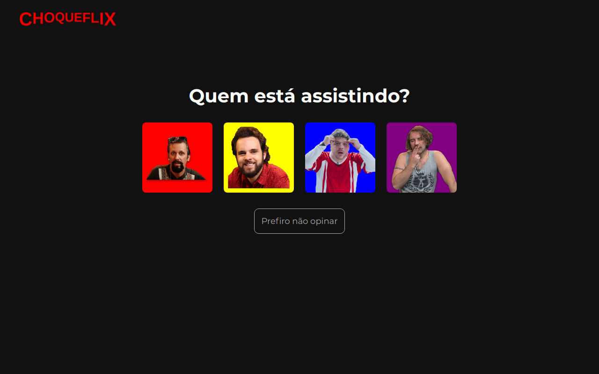

## ChoqueFlix

### Esse foi um projeto bônus da Trybe, pelo qual eu e minha equipe ganhamos o prêmio de melhor projeto da turma, que possui 150 pessoas.

Projeto desenvolvido em parceria com o time...  
Gabriel Takaki > [linkedin](https://www.linkedin.com/in/gabriel-felipe-takaki-99987b214/)  
Nataniel Santos > [linkedin](https://www.linkedin.com/in/nataniel-santos/)  
Gustavo Sant'Anna > [linkedin](https://www.linkedin.com/in/g-s-s/) 

[Link do Site](https://choqueflix.vercel.app/)

## Tech em uso

[JavaScript] Aplication  
Uso de duas API externas sobre filmes como...
  - A [TMDB](https://www.themoviedb.org/)
  - A [OMDB](https://rapidapi.com/blog/lp/omdb-api/)

Uso da biblioteca de CSS [Semantic UI](https://semantic-ui.com/)

# Habilidades desenvolvidas.

-Lidar com diferentes chamadas à API 

-Usar Gulp para customizar a biblioteca de CSS do Semantic UI  

-Criar uma barra de buscas com JQuery  

-Fazer uma aplicação 100% responsiva  

-Criar nosso primeiro site sem ajuda nem supervisão de ninguém, apenas nosso esforço comum do grupo  

-Usar vários eventos diferentes do JavaScript para tornar o site funcional  

# O que foi desenvolvido.

Um site baseado no design da **Netflix** com o tema do canal do youtube Choque de Cultura. Assim que se entra no site é necessário escolher um usuário (igual o netflix) que irá redirecionar para a página principal. Na página inicial irá carregar um banner com um filme aleatório, abaixo do banner uma lista dos filmes atuais mais populares será carregada automagicamente. Na menu de navegação é possível escolher divesas categorias diferentes para poder filtrar o conteúdo, e caso necessário, ainda é possível fazer o uso da barra de buscas para encontrar um título específico. Além disso é o usuário pode criar um lista customizada de filmes para poder assistir depois, sendo que cada usuário terá sua própria lista de favoritos, dependendo de qual personagem for escolhido na tela de login. Além disso e pra finalizar, todos os cards possuem um botão para poder visualizar o trailer, onde o usuário será redirecionado para o youtube.

  - Logar no site, escolhendo sempre um usuário para poder ir para a página principal.
  - Visualizar um banner e uma lista de filmes na tela principal.
  - Poder escolher uma entre várias categorias diferentes para poder filtrar a lista de filmes que aparece na tela.
  - Armazenar uma lista personalizada que será salva no LocalStorage, dependendo de qual personagem foi escolhido na tela de login.
  - Poder clicar e ser redirecionado pro youtube para ver o trailer do filme.
  - Usar o SearchBar para escolher um título específico.
